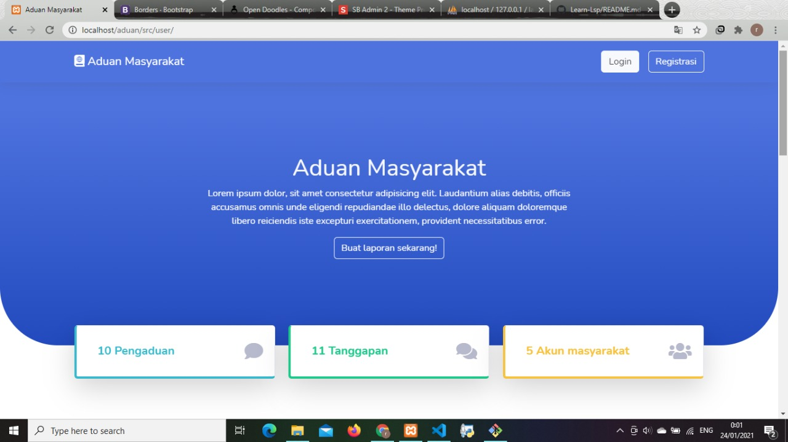
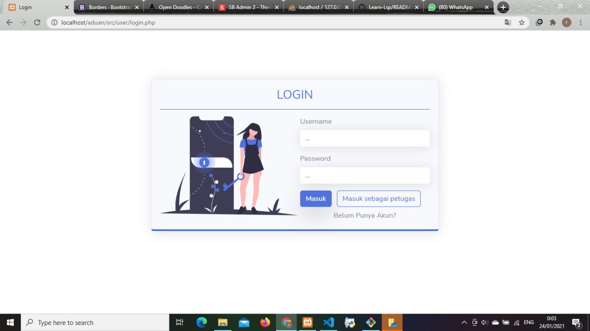
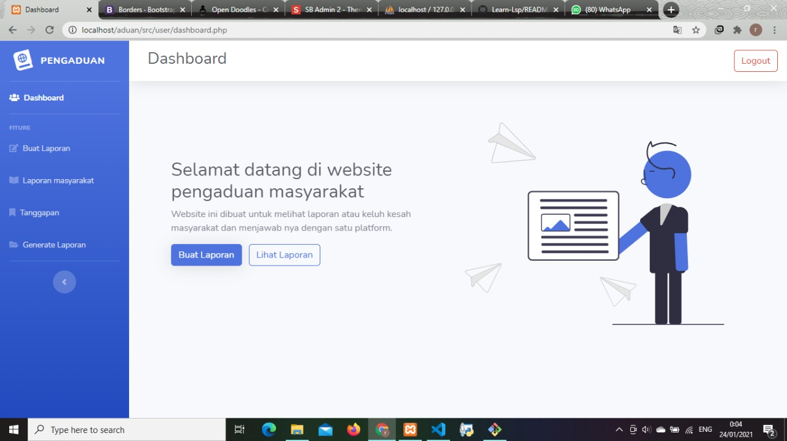

# Hello Everyone
I Creating a website about public complaints created using the following template sb admin 2 and Bootstrap for the frontend and native PHP for the backend

 
<h3>website display</h3>

 

- Landing pages

 

- Login

 

- Dashboard

